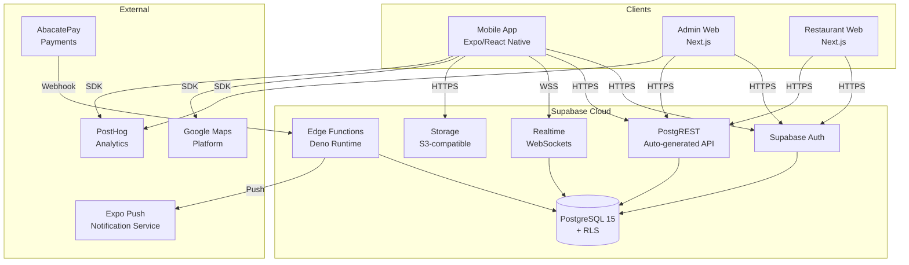
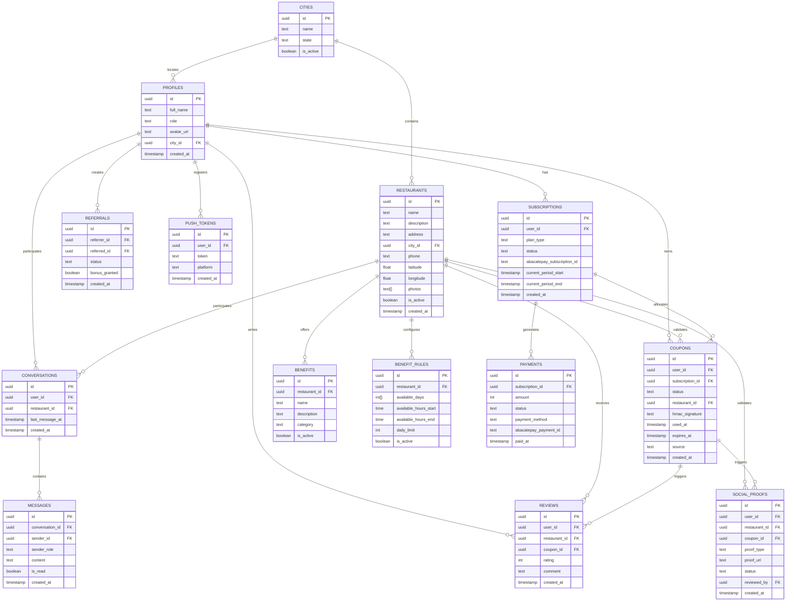
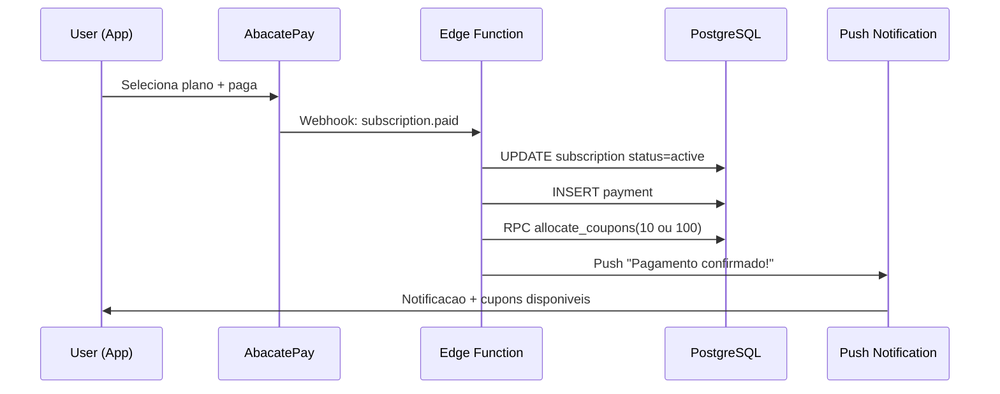
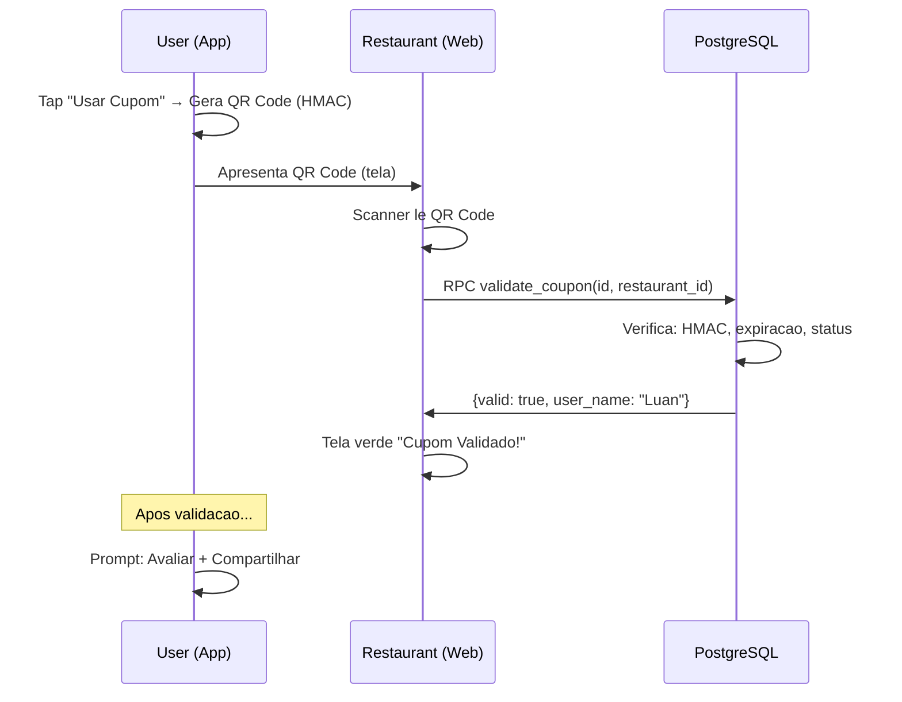
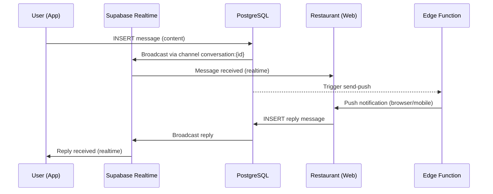
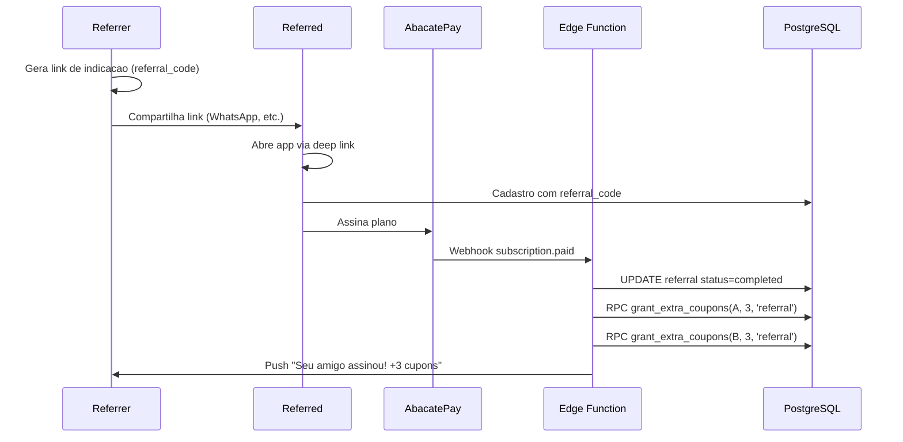

# +um — Fullstack Architecture Document

> **Versao:** 1.0
> **Data:** 2026-03-19
> **Autor:** Aria (@architect)
> **Status:** Draft
> **Base:** `docs/prd.md` v1.0, `docs/front-end-spec.md` v1.0

---

## 1. Introduction

Este documento define a arquitetura completa do ecossistema +um: app mobile (Expo/React Native), dois paineis admin web (Next.js), backend serverless (Supabase), pagamentos (AbacatePay) e infraestrutura. Serve como single source of truth para desenvolvimento AI-driven, garantindo consistencia em todo o stack.

**Starter Template:** N/A — Greenfield project. Monorepo Turborepo criado do zero.

### Change Log

| Date | Version | Description | Author |
|------|---------|-------------|--------|
| 2026-03-19 | 1.0 | Arquitetura inicial completa | Aria (@architect) |

---

## 2. High Level Architecture

### 2.1 Technical Summary

Arquitetura serverless-first usando Supabase como BaaS (Backend as a Service), com PostgreSQL 15 gerenciado, autenticacao integrada, Realtime WebSockets e Edge Functions (Deno). O frontend mobile usa Expo SDK 52+ com React Native, enquanto os paineis admin usam Next.js 14+ com App Router. Pagamentos sao processados via AbacatePay com webhooks para Edge Functions. A infraestrutura e deployada via Supabase Cloud (backend) e Vercel (admin webs), com o app mobile distribuido via Expo EAS. Multi-tenancy e alcancada via Row Level Security (RLS) no PostgreSQL, eliminando a necessidade de schemas separados.

### 2.2 Platform and Infrastructure

**Platform:** Supabase Cloud + Vercel + Expo EAS

**Key Services:**
- **Supabase:** PostgreSQL 15, Auth, Realtime, Storage, Edge Functions
- **Vercel:** Hosting dos 2 admin webs (Next.js)
- **Expo EAS:** Build e distribuicao do app mobile (iOS + Android)
- **AbacatePay:** Processamento de pagamentos (PIX, cartao, boleto)
- **Google Maps Platform:** Maps SDK + Geocoding API
- **PostHog Cloud:** Analytics e event tracking

**Deployment Regions:** Supabase South America (sa-east-1), Vercel Edge (auto)

### 2.3 Repository Structure

**Structure:** Turborepo Monorepo

```
maisum/
├── apps/
│   ├── mobile/              # Expo app — cliente iOS/Android
│   ├── admin-web/           # Next.js — painel admin +um
│   └── restaurant-web/      # Next.js — painel restaurante
├── packages/
│   ├── shared/              # Types TS, validacoes Zod, constantes, utils
│   └── ui/                  # Componentes React compartilhados (admin webs only)
├── supabase/
│   ├── migrations/          # SQL migrations (schema versionado)
│   ├── functions/           # Edge Functions (Deno/TypeScript)
│   ├── seed.sql             # Dados iniciais
│   └── config.toml          # Config local
├── docs/                    # Documentacao do projeto
├── .github/workflows/       # CI/CD
├── turbo.json               # Turborepo config
├── package.json             # Root workspace
└── .env.example             # Template de variaveis
```

### 2.4 Architecture Diagram



### 2.5 Architectural Patterns

- **Serverless BaaS:** Supabase como backend completo, sem servidor custom — _Rationale:_ Reduz complexidade operacional, time-to-market rapido, escala automatica
- **Row Level Security (RLS):** Controle de acesso no nivel do banco — _Rationale:_ Seguranca enforced pelo PostgreSQL, impossivel bypassar via API
- **Event-Driven Webhooks:** AbacatePay notifica via webhook → Edge Function processa — _Rationale:_ Desacoplamento entre pagamento e logica de negocios
- **Realtime Channels:** Supabase Realtime para chat (1 channel por conversa) — _Rationale:_ WebSocket gerenciado, sem infra adicional
- **Atomic Design (Frontend):** Componentes organizados em Atoms → Molecules → Organisms — _Rationale:_ Reutilizacao e consistencia visual
- **Monorepo com Shared Packages:** Types e validacoes compartilhados entre 3 apps — _Rationale:_ Single source of truth para interfaces de dados
- **Offline-First QR Code:** QR pre-gerado e cacheado no device — _Rationale:_ Funciona sem internet no momento critico de uso

---

## 3. Tech Stack

| Category | Technology | Version | Purpose |
|----------|-----------|---------|---------|
| Mobile Framework | Expo + React Native | SDK 52+ | App iOS/Android cross-platform |
| Mobile Routing | Expo Router | ~4.x | File-based routing + deep linking |
| Mobile Styling | NativeWind | ^4.x | Tailwind CSS para React Native |
| Mobile Animations | React Native Reanimated | ~3.x | Animacoes 60fps nativas |
| Mobile Maps | React Native Maps | ^1.x | Mapa interativo Google Maps |
| Mobile QR | react-native-qrcode-svg | ^6.x | Geracao de QR Code SVG |
| Mobile Camera | expo-camera | ~16.x | Scanner QR |
| Mobile Push | expo-notifications | ~0.x | Push notifications |
| Web Framework | Next.js | ^14.x | Admin webs com App Router + SSR |
| Web Styling | Tailwind CSS | ^4.x | Utility-first CSS |
| Web Components | shadcn/ui + Radix | latest | Componentes acessiveis |
| Web Charts | Recharts | ^2.x | Graficos nos dashboards |
| State Management | Zustand | ^5.x | Estado global leve |
| Forms | React Hook Form + Zod | ^7.x / ^3.x | Validacao type-safe |
| Icons | Phosphor Icons | ^2.x | Icones unificados RN + Web |
| Database | PostgreSQL | 15 | Via Supabase (managed) |
| Backend | Supabase | latest | Auth, REST API, Realtime, Storage, Edge Functions |
| Edge Functions | Deno (TypeScript) | latest | Logica server-side (webhooks, push) |
| Payments | AbacatePay | latest | PIX, cartao, boleto, assinaturas |
| Analytics | PostHog | latest | Event tracking, funnels |
| Monorepo | Turborepo | latest | Build orchestration |
| Language | TypeScript | ^5.x | Type safety em todo o stack |
| Linting | ESLint + Prettier | latest | Code style consistente |
| Testing | Vitest + Testing Library | latest | Unit + integration tests |
| CI/CD | GitHub Actions | — | Build, test, deploy automatizado |

---

## 4. Data Models

### 4.1 Entity Relationship Diagram



### 4.2 TypeScript Interfaces (packages/shared)

```typescript
// packages/shared/src/types/database.ts

export type UserRole = 'user' | 'restaurant_admin' | 'super_admin';
export type PlanType = 'monthly' | 'annual';
export type SubscriptionStatus = 'active' | 'cancelled' | 'past_due' | 'expired';
export type CouponStatus = 'available' | 'used' | 'expired';
export type CouponSource = 'subscription' | 'referral' | 'review' | 'social';
export type BenefitCategory = 'prato' | 'drink' | 'sobremesa' | 'combo';
export type ReferralStatus = 'pending' | 'completed';
export type SocialProofStatus = 'pending' | 'approved' | 'rejected';
export type SocialProofType = 'screenshot' | 'link';
export type PaymentStatus = 'pending' | 'paid' | 'failed' | 'refunded';
export type PaymentMethod = 'pix' | 'credit_card' | 'boleto';

export interface Profile {
  id: string;
  full_name: string;
  role: UserRole;
  avatar_url: string | null;
  city_id: string | null;
  referral_code: string;
  created_at: string;
}

export interface Restaurant {
  id: string;
  name: string;
  description: string;
  address: string;
  city_id: string;
  phone: string;
  latitude: number;
  longitude: number;
  photos: string[];
  cuisine_type: string;
  is_active: boolean;
  created_at: string;
}

export interface City {
  id: string;
  name: string;
  state: string;
  is_active: boolean;
}

export interface Subscription {
  id: string;
  user_id: string;
  plan_type: PlanType;
  status: SubscriptionStatus;
  abacatepay_subscription_id: string;
  current_period_start: string;
  current_period_end: string;
  created_at: string;
}

export interface Coupon {
  id: string;
  user_id: string;
  subscription_id: string | null;
  status: CouponStatus;
  restaurant_id: string | null;
  hmac_signature: string;
  used_at: string | null;
  expires_at: string;
  source: CouponSource;
  created_at: string;
}

export interface Benefit {
  id: string;
  restaurant_id: string;
  name: string;
  description: string;
  category: BenefitCategory;
  is_active: boolean;
}

export interface BenefitRule {
  id: string;
  restaurant_id: string;
  available_days: number[]; // 0=dom, 1=seg, ..., 6=sab
  available_hours_start: string; // HH:mm
  available_hours_end: string;
  daily_limit: number;
  is_active: boolean;
}

export interface Review {
  id: string;
  user_id: string;
  restaurant_id: string;
  coupon_id: string;
  rating: number; // 1-5
  comment: string | null;
  created_at: string;
}

export interface Conversation {
  id: string;
  user_id: string;
  restaurant_id: string;
  last_message_at: string;
  created_at: string;
}

export interface Message {
  id: string;
  conversation_id: string;
  sender_id: string;
  sender_role: UserRole;
  content: string;
  is_read: boolean;
  created_at: string;
}

export interface Referral {
  id: string;
  referrer_id: string;
  referred_id: string | null;
  status: ReferralStatus;
  bonus_granted: boolean;
  created_at: string;
}

export interface SocialProof {
  id: string;
  user_id: string;
  restaurant_id: string;
  coupon_id: string;
  proof_type: SocialProofType;
  proof_url: string;
  status: SocialProofStatus;
  reviewed_by: string | null;
  created_at: string;
}

export interface Payment {
  id: string;
  subscription_id: string;
  amount: number; // centavos
  status: PaymentStatus;
  payment_method: PaymentMethod;
  abacatepay_payment_id: string;
  paid_at: string | null;
}

export interface RestaurantInvite {
  id: string;
  restaurant_id: string;
  token: string;
  expires_at: string;
  used_at: string | null;
  created_at: string;
}

export interface PushToken {
  id: string;
  user_id: string;
  token: string;
  platform: 'ios' | 'android';
  created_at: string;
}
```

---

## 5. Database Schema (PostgreSQL 15 + RLS)

### 5.1 Complete DDL

```sql
-- ===========================================
-- +um Database Schema — V1.0
-- ===========================================

-- Enable extensions
CREATE EXTENSION IF NOT EXISTS "uuid-ossp";
CREATE EXTENSION IF NOT EXISTS "pgcrypto";

-- ===========================================
-- ENUM TYPES
-- ===========================================

CREATE TYPE user_role AS ENUM ('user', 'restaurant_admin', 'super_admin');
CREATE TYPE plan_type AS ENUM ('monthly', 'annual');
CREATE TYPE subscription_status AS ENUM ('active', 'cancelled', 'past_due', 'expired');
CREATE TYPE coupon_status AS ENUM ('available', 'used', 'expired');
CREATE TYPE coupon_source AS ENUM ('subscription', 'referral', 'review', 'social');
CREATE TYPE benefit_category AS ENUM ('prato', 'drink', 'sobremesa', 'combo');
CREATE TYPE referral_status AS ENUM ('pending', 'completed');
CREATE TYPE social_proof_status AS ENUM ('pending', 'approved', 'rejected');
CREATE TYPE social_proof_type AS ENUM ('screenshot', 'link');
CREATE TYPE payment_status AS ENUM ('pending', 'paid', 'failed', 'refunded');
CREATE TYPE payment_method AS ENUM ('pix', 'credit_card', 'boleto');

-- ===========================================
-- TABLES
-- ===========================================

-- Cities (must exist before restaurants and profiles)
CREATE TABLE cities (
  id UUID PRIMARY KEY DEFAULT uuid_generate_v4(),
  name TEXT NOT NULL,
  state TEXT NOT NULL,
  is_active BOOLEAN DEFAULT true,
  created_at TIMESTAMPTZ DEFAULT now()
);

-- Profiles (extends auth.users)
CREATE TABLE profiles (
  id UUID PRIMARY KEY REFERENCES auth.users(id) ON DELETE CASCADE,
  full_name TEXT NOT NULL,
  role user_role DEFAULT 'user',
  avatar_url TEXT,
  city_id UUID REFERENCES cities(id),
  referral_code TEXT UNIQUE DEFAULT encode(gen_random_bytes(6), 'hex'),
  extra_coupons_this_month INT DEFAULT 0,
  created_at TIMESTAMPTZ DEFAULT now()
);

-- Restaurants
CREATE TABLE restaurants (
  id UUID PRIMARY KEY DEFAULT uuid_generate_v4(),
  name TEXT NOT NULL,
  description TEXT,
  address TEXT NOT NULL,
  city_id UUID NOT NULL REFERENCES cities(id),
  phone TEXT,
  cuisine_type TEXT,
  latitude DOUBLE PRECISION NOT NULL,
  longitude DOUBLE PRECISION NOT NULL,
  photos TEXT[] DEFAULT '{}',
  is_active BOOLEAN DEFAULT true,
  admin_user_id UUID REFERENCES profiles(id),
  created_at TIMESTAMPTZ DEFAULT now()
);

-- Restaurant Invites
CREATE TABLE restaurant_invites (
  id UUID PRIMARY KEY DEFAULT uuid_generate_v4(),
  restaurant_id UUID NOT NULL REFERENCES restaurants(id) ON DELETE CASCADE,
  token TEXT UNIQUE NOT NULL DEFAULT encode(gen_random_bytes(32), 'hex'),
  expires_at TIMESTAMPTZ NOT NULL DEFAULT (now() + INTERVAL '7 days'),
  used_at TIMESTAMPTZ,
  created_at TIMESTAMPTZ DEFAULT now()
);

-- Benefits
CREATE TABLE benefits (
  id UUID PRIMARY KEY DEFAULT uuid_generate_v4(),
  restaurant_id UUID NOT NULL REFERENCES restaurants(id) ON DELETE CASCADE,
  name TEXT NOT NULL,
  description TEXT,
  category benefit_category NOT NULL,
  is_active BOOLEAN DEFAULT true,
  created_at TIMESTAMPTZ DEFAULT now()
);

-- Benefit Rules
CREATE TABLE benefit_rules (
  id UUID PRIMARY KEY DEFAULT uuid_generate_v4(),
  restaurant_id UUID NOT NULL REFERENCES restaurants(id) ON DELETE CASCADE,
  available_days INT[] DEFAULT '{0,1,2,3,4,5,6}',
  available_hours_start TIME DEFAULT '00:00',
  available_hours_end TIME DEFAULT '23:59',
  daily_limit INT DEFAULT 50,
  is_active BOOLEAN DEFAULT true,
  created_at TIMESTAMPTZ DEFAULT now()
);

-- Subscriptions
CREATE TABLE subscriptions (
  id UUID PRIMARY KEY DEFAULT uuid_generate_v4(),
  user_id UUID NOT NULL REFERENCES profiles(id) ON DELETE CASCADE,
  plan_type plan_type NOT NULL,
  status subscription_status DEFAULT 'active',
  abacatepay_subscription_id TEXT UNIQUE,
  current_period_start TIMESTAMPTZ NOT NULL,
  current_period_end TIMESTAMPTZ NOT NULL,
  created_at TIMESTAMPTZ DEFAULT now()
);

-- Coupons
CREATE TABLE coupons (
  id UUID PRIMARY KEY DEFAULT uuid_generate_v4(),
  user_id UUID NOT NULL REFERENCES profiles(id) ON DELETE CASCADE,
  subscription_id UUID REFERENCES subscriptions(id),
  status coupon_status DEFAULT 'available',
  restaurant_id UUID REFERENCES restaurants(id),
  hmac_signature TEXT NOT NULL DEFAULT encode(
    hmac(uuid_generate_v4()::text, current_setting('app.hmac_secret', true), 'sha256'),
    'hex'
  ),
  used_at TIMESTAMPTZ,
  expires_at TIMESTAMPTZ NOT NULL,
  source coupon_source DEFAULT 'subscription',
  created_at TIMESTAMPTZ DEFAULT now()
);

-- Reviews
CREATE TABLE reviews (
  id UUID PRIMARY KEY DEFAULT uuid_generate_v4(),
  user_id UUID NOT NULL REFERENCES profiles(id) ON DELETE CASCADE,
  restaurant_id UUID NOT NULL REFERENCES restaurants(id) ON DELETE CASCADE,
  coupon_id UUID REFERENCES coupons(id),
  rating INT NOT NULL CHECK (rating >= 1 AND rating <= 5),
  comment TEXT,
  created_at TIMESTAMPTZ DEFAULT now(),
  UNIQUE(user_id, coupon_id) -- 1 review per coupon use
);

-- Conversations
CREATE TABLE conversations (
  id UUID PRIMARY KEY DEFAULT uuid_generate_v4(),
  user_id UUID NOT NULL REFERENCES profiles(id) ON DELETE CASCADE,
  restaurant_id UUID NOT NULL REFERENCES restaurants(id) ON DELETE CASCADE,
  last_message_at TIMESTAMPTZ DEFAULT now(),
  created_at TIMESTAMPTZ DEFAULT now(),
  UNIQUE(user_id, restaurant_id) -- 1 conversation per user-restaurant pair
);

-- Messages
CREATE TABLE messages (
  id UUID PRIMARY KEY DEFAULT uuid_generate_v4(),
  conversation_id UUID NOT NULL REFERENCES conversations(id) ON DELETE CASCADE,
  sender_id UUID NOT NULL REFERENCES profiles(id),
  sender_role user_role NOT NULL,
  content TEXT NOT NULL,
  is_read BOOLEAN DEFAULT false,
  created_at TIMESTAMPTZ DEFAULT now()
);

-- Referrals
CREATE TABLE referrals (
  id UUID PRIMARY KEY DEFAULT uuid_generate_v4(),
  referrer_id UUID NOT NULL REFERENCES profiles(id),
  referred_id UUID REFERENCES profiles(id),
  status referral_status DEFAULT 'pending',
  bonus_granted BOOLEAN DEFAULT false,
  created_at TIMESTAMPTZ DEFAULT now()
);

-- Social Proofs
CREATE TABLE social_proofs (
  id UUID PRIMARY KEY DEFAULT uuid_generate_v4(),
  user_id UUID NOT NULL REFERENCES profiles(id) ON DELETE CASCADE,
  restaurant_id UUID NOT NULL REFERENCES restaurants(id),
  coupon_id UUID REFERENCES coupons(id),
  proof_type social_proof_type NOT NULL,
  proof_url TEXT NOT NULL,
  status social_proof_status DEFAULT 'pending',
  reviewed_by UUID REFERENCES profiles(id),
  created_at TIMESTAMPTZ DEFAULT now()
);

-- Payments
CREATE TABLE payments (
  id UUID PRIMARY KEY DEFAULT uuid_generate_v4(),
  subscription_id UUID NOT NULL REFERENCES subscriptions(id) ON DELETE CASCADE,
  amount INT NOT NULL, -- centavos
  status payment_status DEFAULT 'pending',
  payment_method payment_method NOT NULL,
  abacatepay_payment_id TEXT UNIQUE,
  paid_at TIMESTAMPTZ,
  created_at TIMESTAMPTZ DEFAULT now()
);

-- Push Tokens
CREATE TABLE push_tokens (
  id UUID PRIMARY KEY DEFAULT uuid_generate_v4(),
  user_id UUID NOT NULL REFERENCES profiles(id) ON DELETE CASCADE,
  token TEXT NOT NULL,
  platform TEXT NOT NULL CHECK (platform IN ('ios', 'android')),
  created_at TIMESTAMPTZ DEFAULT now(),
  UNIQUE(user_id, token)
);

-- ===========================================
-- INDEXES
-- ===========================================

-- Restaurants: busca por cidade e localizacao
CREATE INDEX idx_restaurants_city ON restaurants(city_id) WHERE is_active = true;
CREATE INDEX idx_restaurants_location ON restaurants(latitude, longitude) WHERE is_active = true;
CREATE INDEX idx_restaurants_admin ON restaurants(admin_user_id);

-- Coupons: busca por usuario e status
CREATE INDEX idx_coupons_user_status ON coupons(user_id, status);
CREATE INDEX idx_coupons_user_restaurant ON coupons(user_id, restaurant_id, status);
CREATE INDEX idx_coupons_expires ON coupons(expires_at) WHERE status = 'available';

-- Subscriptions: busca por usuario
CREATE INDEX idx_subscriptions_user ON subscriptions(user_id, status);
CREATE INDEX idx_subscriptions_abacatepay ON subscriptions(abacatepay_subscription_id);

-- Messages: busca por conversa
CREATE INDEX idx_messages_conversation ON messages(conversation_id, created_at DESC);
CREATE INDEX idx_messages_unread ON messages(conversation_id) WHERE is_read = false;

-- Conversations: busca por usuario e restaurante
CREATE INDEX idx_conversations_user ON conversations(user_id, last_message_at DESC);
CREATE INDEX idx_conversations_restaurant ON conversations(restaurant_id, last_message_at DESC);

-- Reviews: media por restaurante
CREATE INDEX idx_reviews_restaurant ON reviews(restaurant_id, rating);
CREATE INDEX idx_reviews_user ON reviews(user_id);

-- Referrals
CREATE INDEX idx_referrals_referrer ON referrals(referrer_id);
CREATE INDEX idx_referrals_referred ON referrals(referred_id);

-- Social Proofs
CREATE INDEX idx_social_proofs_pending ON social_proofs(status) WHERE status = 'pending';
CREATE INDEX idx_social_proofs_restaurant ON social_proofs(restaurant_id, status);

-- Benefits
CREATE INDEX idx_benefits_restaurant ON benefits(restaurant_id) WHERE is_active = true;

-- Payments
CREATE INDEX idx_payments_subscription ON payments(subscription_id, created_at DESC);

-- ===========================================
-- ROW LEVEL SECURITY (RLS)
-- ===========================================

ALTER TABLE profiles ENABLE ROW LEVEL SECURITY;
ALTER TABLE restaurants ENABLE ROW LEVEL SECURITY;
ALTER TABLE cities ENABLE ROW LEVEL SECURITY;
ALTER TABLE subscriptions ENABLE ROW LEVEL SECURITY;
ALTER TABLE coupons ENABLE ROW LEVEL SECURITY;
ALTER TABLE benefits ENABLE ROW LEVEL SECURITY;
ALTER TABLE benefit_rules ENABLE ROW LEVEL SECURITY;
ALTER TABLE reviews ENABLE ROW LEVEL SECURITY;
ALTER TABLE conversations ENABLE ROW LEVEL SECURITY;
ALTER TABLE messages ENABLE ROW LEVEL SECURITY;
ALTER TABLE referrals ENABLE ROW LEVEL SECURITY;
ALTER TABLE social_proofs ENABLE ROW LEVEL SECURITY;
ALTER TABLE payments ENABLE ROW LEVEL SECURITY;
ALTER TABLE push_tokens ENABLE ROW LEVEL SECURITY;
ALTER TABLE restaurant_invites ENABLE ROW LEVEL SECURITY;

-- Helper function: get current user role
CREATE OR REPLACE FUNCTION get_user_role()
RETURNS user_role AS $$
  SELECT role FROM profiles WHERE id = auth.uid();
$$ LANGUAGE sql SECURITY DEFINER STABLE;

-- Helper function: get restaurant_id for current restaurant_admin
CREATE OR REPLACE FUNCTION get_my_restaurant_id()
RETURNS UUID AS $$
  SELECT id FROM restaurants WHERE admin_user_id = auth.uid() LIMIT 1;
$$ LANGUAGE sql SECURITY DEFINER STABLE;

-- PROFILES
CREATE POLICY "Users can view own profile" ON profiles FOR SELECT USING (id = auth.uid());
CREATE POLICY "Users can update own profile" ON profiles FOR UPDATE USING (id = auth.uid());
CREATE POLICY "Super admin can view all profiles" ON profiles FOR SELECT USING (get_user_role() = 'super_admin');
CREATE POLICY "Super admin can update all profiles" ON profiles FOR UPDATE USING (get_user_role() = 'super_admin');

-- CITIES (public read)
CREATE POLICY "Anyone can view active cities" ON cities FOR SELECT USING (is_active = true);
CREATE POLICY "Super admin full access to cities" ON cities FOR ALL USING (get_user_role() = 'super_admin');

-- RESTAURANTS
CREATE POLICY "Anyone can view active restaurants" ON restaurants FOR SELECT USING (is_active = true);
CREATE POLICY "Restaurant admin can view own" ON restaurants FOR SELECT USING (admin_user_id = auth.uid());
CREATE POLICY "Restaurant admin can update own" ON restaurants FOR UPDATE USING (admin_user_id = auth.uid());
CREATE POLICY "Super admin full access" ON restaurants FOR ALL USING (get_user_role() = 'super_admin');

-- RESTAURANT INVITES
CREATE POLICY "Super admin manages invites" ON restaurant_invites FOR ALL USING (get_user_role() = 'super_admin');
CREATE POLICY "Public can read valid invites" ON restaurant_invites FOR SELECT USING (used_at IS NULL AND expires_at > now());

-- SUBSCRIPTIONS
CREATE POLICY "Users view own subscriptions" ON subscriptions FOR SELECT USING (user_id = auth.uid());
CREATE POLICY "Super admin view all" ON subscriptions FOR SELECT USING (get_user_role() = 'super_admin');

-- COUPONS
CREATE POLICY "Users view own coupons" ON coupons FOR SELECT USING (user_id = auth.uid());
CREATE POLICY "Restaurant admin can view coupons for their restaurant" ON coupons FOR SELECT USING (restaurant_id = get_my_restaurant_id());
CREATE POLICY "Super admin view all coupons" ON coupons FOR SELECT USING (get_user_role() = 'super_admin');

-- BENEFITS (public read for active)
CREATE POLICY "Anyone can view active benefits" ON benefits FOR SELECT USING (is_active = true);
CREATE POLICY "Restaurant admin manages own benefits" ON benefits FOR ALL USING (restaurant_id = get_my_restaurant_id());
CREATE POLICY "Super admin full access" ON benefits FOR ALL USING (get_user_role() = 'super_admin');

-- BENEFIT RULES
CREATE POLICY "Anyone can view active rules" ON benefit_rules FOR SELECT USING (is_active = true);
CREATE POLICY "Restaurant admin manages own rules" ON benefit_rules FOR ALL USING (restaurant_id = get_my_restaurant_id());
CREATE POLICY "Super admin full access" ON benefit_rules FOR ALL USING (get_user_role() = 'super_admin');

-- REVIEWS
CREATE POLICY "Anyone can view reviews" ON reviews FOR SELECT USING (true);
CREATE POLICY "Users can create reviews" ON reviews FOR INSERT WITH CHECK (user_id = auth.uid());
CREATE POLICY "Super admin can manage reviews" ON reviews FOR ALL USING (get_user_role() = 'super_admin');

-- CONVERSATIONS
CREATE POLICY "Users view own conversations" ON conversations FOR SELECT USING (user_id = auth.uid());
CREATE POLICY "Restaurant admin views their conversations" ON conversations FOR SELECT USING (restaurant_id = get_my_restaurant_id());
CREATE POLICY "Users can create conversations" ON conversations FOR INSERT WITH CHECK (user_id = auth.uid());

-- MESSAGES
CREATE POLICY "Participants can view messages" ON messages FOR SELECT
  USING (conversation_id IN (
    SELECT id FROM conversations WHERE user_id = auth.uid() OR restaurant_id = get_my_restaurant_id()
  ));
CREATE POLICY "Participants can send messages" ON messages FOR INSERT
  WITH CHECK (sender_id = auth.uid() AND conversation_id IN (
    SELECT id FROM conversations WHERE user_id = auth.uid() OR restaurant_id = get_my_restaurant_id()
  ));
CREATE POLICY "Recipient can mark as read" ON messages FOR UPDATE
  USING (sender_id != auth.uid() AND conversation_id IN (
    SELECT id FROM conversations WHERE user_id = auth.uid() OR restaurant_id = get_my_restaurant_id()
  ));

-- REFERRALS
CREATE POLICY "Users view own referrals" ON referrals FOR SELECT USING (referrer_id = auth.uid() OR referred_id = auth.uid());
CREATE POLICY "Super admin view all" ON referrals FOR SELECT USING (get_user_role() = 'super_admin');

-- SOCIAL PROOFS
CREATE POLICY "Users view own proofs" ON social_proofs FOR SELECT USING (user_id = auth.uid());
CREATE POLICY "Users can submit proofs" ON social_proofs FOR INSERT WITH CHECK (user_id = auth.uid());
CREATE POLICY "Restaurant admin views their proofs" ON social_proofs FOR SELECT USING (restaurant_id = get_my_restaurant_id());
CREATE POLICY "Restaurant admin can review proofs" ON social_proofs FOR UPDATE USING (restaurant_id = get_my_restaurant_id());
CREATE POLICY "Super admin full access" ON social_proofs FOR ALL USING (get_user_role() = 'super_admin');

-- PAYMENTS
CREATE POLICY "Users view own payments" ON payments FOR SELECT
  USING (subscription_id IN (SELECT id FROM subscriptions WHERE user_id = auth.uid()));
CREATE POLICY "Super admin view all" ON payments FOR SELECT USING (get_user_role() = 'super_admin');

-- PUSH TOKENS
CREATE POLICY "Users manage own tokens" ON push_tokens FOR ALL USING (user_id = auth.uid());

-- ===========================================
-- TRIGGERS
-- ===========================================

-- Auto-create profile on auth signup
CREATE OR REPLACE FUNCTION handle_new_user()
RETURNS TRIGGER AS $$
BEGIN
  INSERT INTO profiles (id, full_name, role)
  VALUES (
    NEW.id,
    COALESCE(NEW.raw_user_meta_data->>'full_name', ''),
    'user'
  );
  RETURN NEW;
END;
$$ LANGUAGE plpgsql SECURITY DEFINER;

CREATE TRIGGER on_auth_user_created
  AFTER INSERT ON auth.users
  FOR EACH ROW EXECUTE FUNCTION handle_new_user();

-- Update conversation last_message_at
CREATE OR REPLACE FUNCTION update_conversation_timestamp()
RETURNS TRIGGER AS $$
BEGIN
  UPDATE conversations SET last_message_at = NEW.created_at WHERE id = NEW.conversation_id;
  RETURN NEW;
END;
$$ LANGUAGE plpgsql SECURITY DEFINER;

CREATE TRIGGER on_new_message
  AFTER INSERT ON messages
  FOR EACH ROW EXECUTE FUNCTION update_conversation_timestamp();

-- Reset extra_coupons monthly (run via pg_cron or Edge Function cron)
-- CRON: 0 0 1 * * → UPDATE profiles SET extra_coupons_this_month = 0;

-- ===========================================
-- RPC FUNCTIONS
-- ===========================================

-- Get restaurant with average rating
CREATE OR REPLACE FUNCTION get_restaurant_detail(p_restaurant_id UUID)
RETURNS JSON AS $$
  SELECT json_build_object(
    'restaurant', r,
    'avg_rating', COALESCE((SELECT AVG(rating)::NUMERIC(2,1) FROM reviews WHERE restaurant_id = p_restaurant_id), 0),
    'review_count', (SELECT COUNT(*) FROM reviews WHERE restaurant_id = p_restaurant_id),
    'benefits', (SELECT json_agg(b) FROM benefits b WHERE b.restaurant_id = p_restaurant_id AND b.is_active = true),
    'rules', (SELECT json_agg(br) FROM benefit_rules br WHERE br.restaurant_id = p_restaurant_id AND br.is_active = true)
  )
  FROM restaurants r WHERE r.id = p_restaurant_id;
$$ LANGUAGE sql SECURITY DEFINER STABLE;

-- Get nearby restaurants (simple distance calc)
CREATE OR REPLACE FUNCTION get_nearby_restaurants(p_lat DOUBLE PRECISION, p_lng DOUBLE PRECISION, p_radius_km DOUBLE PRECISION DEFAULT 10)
RETURNS SETOF restaurants AS $$
  SELECT *
  FROM restaurants
  WHERE is_active = true
    AND (
      6371 * acos(
        cos(radians(p_lat)) * cos(radians(latitude)) *
        cos(radians(longitude) - radians(p_lng)) +
        sin(radians(p_lat)) * sin(radians(latitude))
      )
    ) <= p_radius_km
  ORDER BY (
    6371 * acos(
      cos(radians(p_lat)) * cos(radians(latitude)) *
      cos(radians(longitude) - radians(p_lng)) +
      sin(radians(p_lat)) * sin(radians(latitude))
    )
  );
$$ LANGUAGE sql SECURITY DEFINER STABLE;

-- Validate coupon (called by restaurant)
CREATE OR REPLACE FUNCTION validate_coupon(p_coupon_id UUID, p_restaurant_id UUID)
RETURNS JSON AS $$
DECLARE
  v_coupon coupons;
  v_result JSON;
BEGIN
  SELECT * INTO v_coupon FROM coupons WHERE id = p_coupon_id;

  IF v_coupon IS NULL THEN
    RETURN json_build_object('valid', false, 'reason', 'Cupom nao encontrado');
  END IF;

  IF v_coupon.status != 'available' THEN
    RETURN json_build_object('valid', false, 'reason', 'Cupom ja utilizado ou expirado');
  END IF;

  IF v_coupon.expires_at < now() THEN
    UPDATE coupons SET status = 'expired' WHERE id = p_coupon_id;
    RETURN json_build_object('valid', false, 'reason', 'Cupom expirado');
  END IF;

  -- Mark as used
  UPDATE coupons
  SET status = 'used', used_at = now(), restaurant_id = p_restaurant_id
  WHERE id = p_coupon_id;

  RETURN json_build_object(
    'valid', true,
    'user_name', (SELECT full_name FROM profiles WHERE id = v_coupon.user_id),
    'coupon_id', p_coupon_id
  );
END;
$$ LANGUAGE plpgsql SECURITY DEFINER;

-- Allocate coupons for subscription
CREATE OR REPLACE FUNCTION allocate_coupons(p_user_id UUID, p_subscription_id UUID, p_plan plan_type)
RETURNS INT AS $$
DECLARE
  v_count INT;
  v_expires TIMESTAMPTZ;
BEGIN
  IF p_plan = 'monthly' THEN
    v_count := 10;
    v_expires := now() + INTERVAL '30 days';
  ELSE
    v_count := 100;
    v_expires := now() + INTERVAL '365 days';
  END IF;

  INSERT INTO coupons (user_id, subscription_id, status, expires_at, source)
  SELECT p_user_id, p_subscription_id, 'available', v_expires, 'subscription'
  FROM generate_series(1, v_count);

  RETURN v_count;
END;
$$ LANGUAGE plpgsql SECURITY DEFINER;

-- Grant extra coupons (referral, review, social)
CREATE OR REPLACE FUNCTION grant_extra_coupons(p_user_id UUID, p_count INT, p_source coupon_source)
RETURNS BOOLEAN AS $$
DECLARE
  v_current INT;
  v_sub subscriptions;
BEGIN
  SELECT extra_coupons_this_month INTO v_current FROM profiles WHERE id = p_user_id;
  IF v_current + p_count > 10 THEN
    RETURN false; -- limite de 10 extras/mes
  END IF;

  SELECT * INTO v_sub FROM subscriptions WHERE user_id = p_user_id AND status = 'active' LIMIT 1;
  IF v_sub IS NULL THEN
    RETURN false;
  END IF;

  INSERT INTO coupons (user_id, subscription_id, status, expires_at, source)
  SELECT p_user_id, v_sub.id, 'available', v_sub.current_period_end, p_source
  FROM generate_series(1, p_count);

  UPDATE profiles SET extra_coupons_this_month = extra_coupons_this_month + p_count WHERE id = p_user_id;
  RETURN true;
END;
$$ LANGUAGE plpgsql SECURITY DEFINER;

-- Dashboard: restaurant metrics
CREATE OR REPLACE FUNCTION get_restaurant_metrics(p_restaurant_id UUID, p_days INT DEFAULT 30)
RETURNS JSON AS $$
  SELECT json_build_object(
    'coupons_validated', (SELECT COUNT(*) FROM coupons WHERE restaurant_id = p_restaurant_id AND used_at > now() - (p_days || ' days')::INTERVAL),
    'unique_customers', (SELECT COUNT(DISTINCT user_id) FROM coupons WHERE restaurant_id = p_restaurant_id AND used_at > now() - (p_days || ' days')::INTERVAL),
    'avg_rating', (SELECT COALESCE(AVG(rating)::NUMERIC(2,1), 0) FROM reviews WHERE restaurant_id = p_restaurant_id),
    'total_reviews', (SELECT COUNT(*) FROM reviews WHERE restaurant_id = p_restaurant_id),
    'daily_coupons', (
      SELECT json_agg(json_build_object('date', d, 'count', c))
      FROM (
        SELECT used_at::DATE as d, COUNT(*) as c
        FROM coupons
        WHERE restaurant_id = p_restaurant_id AND used_at > now() - (p_days || ' days')::INTERVAL
        GROUP BY used_at::DATE ORDER BY d
      ) sub
    )
  );
$$ LANGUAGE sql SECURITY DEFINER STABLE;

-- Dashboard: admin metrics
CREATE OR REPLACE FUNCTION get_admin_metrics()
RETURNS JSON AS $$
  SELECT json_build_object(
    'total_users', (SELECT COUNT(*) FROM profiles WHERE role = 'user'),
    'active_subscribers', (SELECT COUNT(*) FROM subscriptions WHERE status = 'active'),
    'mrr', (SELECT COALESCE(SUM(CASE WHEN plan_type = 'monthly' THEN 1490 ELSE 749 END), 0) FROM subscriptions WHERE status = 'active'),
    'coupons_redeemed', (SELECT COUNT(*) FROM coupons WHERE status = 'used'),
    'active_restaurants', (SELECT COUNT(*) FROM restaurants WHERE is_active = true),
    'total_referrals', (SELECT COUNT(*) FROM referrals),
    'referral_conversion', (SELECT COALESCE(
      (COUNT(*) FILTER (WHERE status = 'completed'))::NUMERIC / NULLIF(COUNT(*), 0), 0
    ) FROM referrals)
  );
$$ LANGUAGE sql SECURITY DEFINER STABLE;
```

### 5.2 Seed Data

```sql
-- supabase/seed.sql
INSERT INTO cities (name, state, is_active) VALUES ('Jequié', 'BA', true);
```

---

## 6. Edge Functions

### 6.1 Function Map

| Function | Trigger | Purpose |
|----------|---------|---------|
| `handle-payment-webhook` | AbacatePay POST | Processa eventos de pagamento/assinatura |
| `send-push` | Internal call | Envia push notification via Expo Push API |
| `expire-coupons` | Cron (daily) | Marca cupons expirados |
| `reset-extra-coupons` | Cron (monthly) | Reseta contador de extras |
| `generate-qr-payload` | Client call | Gera payload assinado HMAC para QR Code |

### 6.2 Payment Webhook

```typescript
// supabase/functions/handle-payment-webhook/index.ts
import { serve } from 'https://deno.land/std/http/server.ts'
import { createClient } from 'https://esm.sh/@supabase/supabase-js'

serve(async (req: Request) => {
  // 1. Verify webhook signature (AbacatePay HMAC)
  const signature = req.headers.get('x-abacatepay-signature')
  const body = await req.text()
  const expectedSig = await hmacSHA256(body, Deno.env.get('ABACATEPAY_WEBHOOK_SECRET')!)

  if (signature !== expectedSig) {
    return new Response('Invalid signature', { status: 401 })
  }

  const event = JSON.parse(body)
  const supabase = createClient(
    Deno.env.get('SUPABASE_URL')!,
    Deno.env.get('SUPABASE_SERVICE_ROLE_KEY')!
  )

  switch (event.type) {
    case 'subscription.paid': {
      // Update subscription status
      const { data: sub } = await supabase
        .from('subscriptions')
        .update({ status: 'active', current_period_start: event.data.period_start, current_period_end: event.data.period_end })
        .eq('abacatepay_subscription_id', event.data.subscription_id)
        .select()
        .single()

      // Record payment
      await supabase.from('payments').insert({
        subscription_id: sub.id,
        amount: event.data.amount,
        status: 'paid',
        payment_method: event.data.payment_method,
        abacatepay_payment_id: event.data.payment_id,
        paid_at: new Date().toISOString(),
      })

      // Allocate coupons
      await supabase.rpc('allocate_coupons', {
        p_user_id: sub.user_id,
        p_subscription_id: sub.id,
        p_plan: sub.plan_type,
      })

      // Send push
      await sendPush(supabase, sub.user_id, {
        title: 'Pagamento confirmado!',
        body: `Seus cupons ja estao disponiveis.`,
      })
      break
    }

    case 'subscription.cancelled': {
      await supabase
        .from('subscriptions')
        .update({ status: 'cancelled' })
        .eq('abacatepay_subscription_id', event.data.subscription_id)
      break
    }

    case 'subscription.failed': {
      await supabase
        .from('subscriptions')
        .update({ status: 'past_due' })
        .eq('abacatepay_subscription_id', event.data.subscription_id)

      // Notify user
      const { data: sub } = await supabase
        .from('subscriptions')
        .select('user_id')
        .eq('abacatepay_subscription_id', event.data.subscription_id)
        .single()

      await sendPush(supabase, sub.user_id, {
        title: 'Problema no pagamento',
        body: 'Atualize seu metodo de pagamento para continuar usando seus cupons.',
      })
      break
    }
  }

  return new Response('OK', { status: 200 })
})
```

### 6.3 QR Code Anti-Fraud (HMAC)

```typescript
// supabase/functions/generate-qr-payload/index.ts

interface QRPayload {
  coupon_id: string
  user_id: string
  restaurant_id: string
  timestamp: number
  signature: string
}

// Client-side: gera payload (pode ser pre-gerado offline)
function generateQRPayload(couponId: string, userId: string, restaurantId: string, secret: string): QRPayload {
  const timestamp = Date.now()
  const data = `${couponId}:${userId}:${restaurantId}:${timestamp}`
  const signature = hmacSHA256(data, secret)

  return { coupon_id: couponId, user_id: userId, restaurant_id: restaurantId, timestamp, signature }
}

// Server-side: valida payload
function validateQRPayload(payload: QRPayload, secret: string): { valid: boolean; reason?: string } {
  // Check expiration (15 minutes)
  const age = Date.now() - payload.timestamp
  if (age > 15 * 60 * 1000) {
    return { valid: false, reason: 'QR Code expirado' }
  }

  // Verify HMAC
  const data = `${payload.coupon_id}:${payload.user_id}:${payload.restaurant_id}:${payload.timestamp}`
  const expectedSig = hmacSHA256(data, secret)
  if (payload.signature !== expectedSig) {
    return { valid: false, reason: 'Assinatura invalida' }
  }

  return { valid: true }
}
```

---

## 7. External APIs

### 7.1 AbacatePay

- **Purpose:** Processamento de pagamentos e assinaturas recorrentes
- **Authentication:** API Key (Bearer token)
- **Key Endpoints:**
  - `POST /subscriptions` — Criar assinatura recorrente
  - `POST /subscriptions/:id/cancel` — Cancelar assinatura
  - `GET /subscriptions/:id` — Status da assinatura
- **Webhook Events:** `subscription.created`, `subscription.paid`, `subscription.cancelled`, `subscription.failed`
- **Rate Limits:** Consultar docs AbacatePay
- **Integration:** Edge Function `handle-payment-webhook` recebe webhooks, SDK no app para checkout

### 7.2 Google Maps Platform

- **Purpose:** Mapa interativo no app mobile
- **Authentication:** API Key (restrita por bundle ID / package name)
- **APIs usadas:**
  - Maps SDK for Android/iOS (via react-native-maps)
  - Geocoding API (opcional, para busca por endereco)
- **Rate Limits:** Free tier 28K map loads/mes, $200 credito mensal
- **Integration:** React Native Maps com Google provider

### 7.3 Expo Push Notification Service

- **Purpose:** Envio de push notifications para iOS/Android
- **Authentication:** Expo Push Token (registrado pelo device)
- **Endpoint:** `POST https://exp.host/--/api/v2/push/send`
- **Rate Limits:** 600 req/min
- **Integration:** Edge Function `send-push` chama Expo Push API

### 7.4 PostHog

- **Purpose:** Analytics, event tracking, funnels, feature flags
- **Authentication:** Project API Key
- **Integration:** SDK nativo (posthog-react-native no mobile, posthog-js no web)
- **Key Events:** `coupon_used`, `subscription_created`, `referral_sent`, `social_proof_submitted`

---

## 8. Core Workflows

### 8.1 Subscription & Coupon Flow



### 8.2 Coupon Redemption Flow



### 8.3 Chat Flow



### 8.4 Referral Flow



---

## 9. Frontend Architecture

### 9.1 Mobile App (Expo) — Component Organization

```
apps/mobile/
├── app/                         # Expo Router (file-based routing)
│   ├── _layout.tsx              # Root layout (providers, auth check)
│   ├── (auth)/                  # Auth group (login, register)
│   │   ├── login.tsx
│   │   ├── register.tsx
│   │   └── forgot-password.tsx
│   ├── (onboarding)/            # Onboarding screens
│   │   └── index.tsx
│   ├── (tabs)/                  # Main tab navigation
│   │   ├── _layout.tsx          # Tab bar config
│   │   ├── index.tsx            # Home (mapa + lista)
│   │   ├── coupons.tsx          # Meus Cupons
│   │   ├── chat/
│   │   │   ├── index.tsx        # Lista de conversas
│   │   │   └── [id].tsx         # Conversa individual
│   │   └── profile/
│   │       ├── index.tsx        # Perfil & config
│   │       ├── subscription.tsx # Gerenciar assinatura
│   │       └── referral.tsx     # Indicar amigos
│   ├── restaurant/
│   │   └── [id].tsx             # Detalhes do restaurante
│   ├── coupon/
│   │   └── [id].tsx             # QR Code do cupom
│   ├── plans.tsx                # Selecao de plano
│   └── review/
│       └── [restaurantId].tsx   # Avaliar experiencia
├── components/
│   ├── atoms/                   # Button, Input, Badge, Avatar, etc.
│   ├── molecules/               # RestaurantCard, CouponCard, ChatBubble, etc.
│   └── organisms/               # TabBar, RestaurantDetail, QRCodeDisplay, etc.
├── hooks/                       # useAuth, useSupabase, useCoupons, useChat, etc.
├── stores/                      # Zustand stores
│   ├── auth.ts
│   ├── coupons.ts
│   └── chat.ts
├── services/                    # Supabase client, API helpers
│   ├── supabase.ts
│   ├── auth.ts
│   ├── restaurants.ts
│   ├── coupons.ts
│   ├── chat.ts
│   └── payments.ts
├── utils/                       # QR generation, HMAC, formatters
│   ├── qr-code.ts
│   ├── hmac.ts
│   └── format.ts
└── constants/                   # Colors, spacing (from design tokens)
```

### 9.2 Admin Webs (Next.js) — Shared Structure

```
apps/admin-web/                  # (restaurant-web segue mesmo padrao)
├── app/
│   ├── layout.tsx               # Root layout (sidebar + providers)
│   ├── (auth)/
│   │   └── login/page.tsx
│   ├── (dashboard)/
│   │   ├── layout.tsx           # Dashboard layout com sidebar
│   │   ├── page.tsx             # Dashboard home
│   │   ├── restaurants/
│   │   │   ├── page.tsx         # Listagem
│   │   │   ├── [id]/page.tsx    # Detalhes/editar
│   │   │   └── new/page.tsx     # Criar novo
│   │   ├── users/page.tsx
│   │   ├── subscriptions/page.tsx
│   │   ├── notifications/page.tsx
│   │   ├── social-proofs/page.tsx
│   │   └── cities/page.tsx
│   └── middleware.ts            # Auth check + role guard
├── components/
│   ├── sidebar.tsx
│   ├── dashboard-card.tsx
│   ├── data-table.tsx           # Generic table component
│   └── ... (uses packages/ui)
├── hooks/
├── services/
└── lib/
    └── supabase/
        ├── client.ts            # Browser client
        └── server.ts            # Server-side client (SSR)
```

### 9.3 State Management (Zustand)

```typescript
// apps/mobile/stores/auth.ts
interface AuthState {
  user: Profile | null
  session: Session | null
  isLoading: boolean
  signIn: (email: string, password: string) => Promise<void>
  signOut: () => Promise<void>
  setUser: (user: Profile) => void
}

// apps/mobile/stores/coupons.ts
interface CouponState {
  coupons: Coupon[]
  available: number
  used: number
  extras: number
  isLoading: boolean
  fetchCoupons: () => Promise<void>
  useCoupon: (couponId: string, restaurantId: string) => Promise<QRPayload>
}

// apps/mobile/stores/chat.ts
interface ChatState {
  conversations: Conversation[]
  activeConversation: string | null
  messages: Record<string, Message[]>
  unreadCount: number
  subscribe: (conversationId: string) => void
  sendMessage: (conversationId: string, content: string) => Promise<void>
}
```

### 9.4 Supabase Client Setup

```typescript
// apps/mobile/services/supabase.ts
import { createClient } from '@supabase/supabase-js'
import AsyncStorage from '@react-native-async-storage/async-storage'
import { Database } from '@maisum/shared/types/supabase'

export const supabase = createClient<Database>(
  process.env.EXPO_PUBLIC_SUPABASE_URL!,
  process.env.EXPO_PUBLIC_SUPABASE_ANON_KEY!,
  {
    auth: {
      storage: AsyncStorage,
      autoRefreshToken: true,
      persistSession: true,
      detectSessionInUrl: false,
    },
  }
)

// apps/admin-web/lib/supabase/client.ts
import { createBrowserClient } from '@supabase/ssr'
import { Database } from '@maisum/shared/types/supabase'

export const createClient = () =>
  createBrowserClient<Database>(
    process.env.NEXT_PUBLIC_SUPABASE_URL!,
    process.env.NEXT_PUBLIC_SUPABASE_ANON_KEY!
  )

// apps/admin-web/lib/supabase/server.ts
import { createServerClient } from '@supabase/ssr'
import { cookies } from 'next/headers'
import { Database } from '@maisum/shared/types/supabase'

export const createClient = () => {
  const cookieStore = cookies()
  return createServerClient<Database>(
    process.env.NEXT_PUBLIC_SUPABASE_URL!,
    process.env.NEXT_PUBLIC_SUPABASE_ANON_KEY!,
    { cookies: { getAll: () => cookieStore.getAll() } }
  )
}
```

### 9.5 Auth Middleware (Next.js)

```typescript
// apps/admin-web/middleware.ts
import { createServerClient } from '@supabase/ssr'
import { NextResponse } from 'next/server'
import type { NextRequest } from 'next/server'

export async function middleware(request: NextRequest) {
  const response = NextResponse.next()

  const supabase = createServerClient(
    process.env.NEXT_PUBLIC_SUPABASE_URL!,
    process.env.NEXT_PUBLIC_SUPABASE_ANON_KEY!,
    { cookies: { getAll: () => request.cookies.getAll() } }
  )

  const { data: { user } } = await supabase.auth.getUser()

  if (!user && !request.nextUrl.pathname.startsWith('/login')) {
    return NextResponse.redirect(new URL('/login', request.url))
  }

  if (user) {
    const { data: profile } = await supabase
      .from('profiles')
      .select('role')
      .eq('id', user.id)
      .single()

    // admin-web requires super_admin
    if (profile?.role !== 'super_admin') {
      return NextResponse.redirect(new URL('/login?error=unauthorized', request.url))
    }
  }

  return response
}

export const config = { matcher: ['/((?!_next/static|_next/image|favicon.ico|login).*)'] }
```

---

## 10. Realtime Chat Architecture

### 10.1 Channel Strategy

```
Channel: conversation:{conversation_id}

Subscribers:
- User (mobile app)
- Restaurant admin (web panel)

Events:
- INSERT on messages → broadcast to channel
- UPDATE on messages (is_read) → broadcast to channel
```

### 10.2 Supabase Realtime Setup

```typescript
// hooks/useChat.ts
const channel = supabase
  .channel(`conversation:${conversationId}`)
  .on('postgres_changes', {
    event: 'INSERT',
    schema: 'public',
    table: 'messages',
    filter: `conversation_id=eq.${conversationId}`,
  }, (payload) => {
    addMessage(payload.new as Message)
  })
  .subscribe()
```

---

## 11. Development Workflow

### 11.1 Prerequisites

```bash
node >= 18.x
npm >= 9.x
supabase CLI >= 1.x
expo-cli (via npx expo)
```

### 11.2 Initial Setup

```bash
git clone <repo-url>
cd maisum
npm install          # Instala todas as deps (workspaces)
cp .env.example .env # Configura variaveis

# Supabase local
supabase start       # Inicia PostgreSQL + Auth + Realtime + Storage locais
supabase db push     # Aplica migrations
supabase db seed     # Seed data (Jequie-BA)

# Gerar types
npx supabase gen types typescript --local > packages/shared/src/types/supabase.ts
```

### 11.3 Development Commands

```bash
# Todos os apps
turbo dev

# Apenas mobile
turbo dev --filter=mobile

# Apenas admin web
turbo dev --filter=admin-web

# Apenas restaurant web
turbo dev --filter=restaurant-web

# Tests
turbo test

# Lint
turbo lint

# Type check
turbo typecheck

# Build
turbo build
```

### 11.4 Environment Variables

```bash
# .env (root — compartilhado)
SUPABASE_URL=http://localhost:54321
SUPABASE_ANON_KEY=<local-anon-key>
SUPABASE_SERVICE_ROLE_KEY=<local-service-role-key>

# apps/mobile/.env
EXPO_PUBLIC_SUPABASE_URL=http://localhost:54321
EXPO_PUBLIC_SUPABASE_ANON_KEY=<local-anon-key>
EXPO_PUBLIC_GOOGLE_MAPS_API_KEY=<google-maps-key>
EXPO_PUBLIC_POSTHOG_API_KEY=<posthog-key>

# apps/admin-web/.env.local (same for restaurant-web)
NEXT_PUBLIC_SUPABASE_URL=http://localhost:54321
NEXT_PUBLIC_SUPABASE_ANON_KEY=<local-anon-key>

# supabase/functions/.env
ABACATEPAY_API_KEY=<abacatepay-key>
ABACATEPAY_WEBHOOK_SECRET=<webhook-secret>
HMAC_SECRET=<random-32-char-secret>
EXPO_PUSH_ACCESS_TOKEN=<expo-push-token>
```

---

## 12. Deployment Architecture

### 12.1 Strategy

| App | Platform | Method |
|-----|----------|--------|
| Mobile | Expo EAS | `eas build` → App Store / Google Play |
| Admin Web | Vercel | Git push → auto deploy |
| Restaurant Web | Vercel | Git push → auto deploy |
| Database/Backend | Supabase Cloud | `supabase db push` (migrations) |
| Edge Functions | Supabase Cloud | `supabase functions deploy` |

### 12.2 Environments

| Environment | Supabase | Admin Web | Restaurant Web | Purpose |
|-------------|----------|-----------|----------------|---------|
| Local | `supabase start` | `localhost:3000` | `localhost:3001` | Development |
| Staging | Supabase staging project | `staging.admin.maisumapp.com` | `staging.restaurant.maisumapp.com` | Pre-production |
| Production | Supabase prod project | `admin.maisumapp.com` | `restaurant.maisumapp.com` | Live |

### 12.3 CI/CD (GitHub Actions)

```yaml
# .github/workflows/ci.yml
name: CI
on: [push, pull_request]

jobs:
  lint-and-test:
    runs-on: ubuntu-latest
    steps:
      - uses: actions/checkout@v4
      - uses: actions/setup-node@v4
        with: { node-version: 18 }
      - run: npm ci
      - run: turbo lint
      - run: turbo typecheck
      - run: turbo test

  deploy-web:
    needs: lint-and-test
    if: github.ref == 'refs/heads/main'
    runs-on: ubuntu-latest
    steps:
      - uses: actions/checkout@v4
      - uses: amondnet/vercel-action@v25
        with:
          vercel-token: ${{ secrets.VERCEL_TOKEN }}
          vercel-org-id: ${{ secrets.VERCEL_ORG_ID }}
          vercel-project-id: ${{ secrets.VERCEL_PROJECT_ID }}
```

---

## 13. Security

### 13.1 Authentication

- **Supabase Auth** com JWT (access token + refresh token)
- Refresh token rotation habilitado
- Social login (Google, Apple) apenas para role `user`
- Sessoes: access token 1h, refresh token 7d

### 13.2 Authorization (RLS)

- **Toda** query passa por RLS — nao existe API sem controle de acesso
- Helper functions `get_user_role()` e `get_my_restaurant_id()` marcadas como `SECURITY DEFINER`
- Service role key usada APENAS em Edge Functions (server-side)
- Anon key usada pelos clients (segura pois RLS filtra)

### 13.3 Anti-Fraud (QR Code)

- QR payload: `coupon_id:user_id:restaurant_id:timestamp`
- Assinado com HMAC-SHA256 (secret no servidor)
- Expiracao: 15 minutos apos geracao
- HMAC secret: rotacionado periodicamente
- Validacao server-side via RPC `validate_coupon()`

### 13.4 Input Validation

- **Client-side:** Zod schemas (packages/shared) — mesmos schemas em mobile e web
- **Server-side:** RLS + CHECK constraints no PostgreSQL + Edge Function validation
- Rate limiting: Supabase built-in + Edge Function custom para webhooks

### 13.5 Data Protection (LGPD)

- Dados pessoais: nome, email, localizacao — armazenados com consentimento
- Direito a exclusao: `auth.users` CASCADE deleta profiles e dados associados
- Logs de consentimento: registrados no signup
- Transparencia: politica de privacidade acessivel no app

---

## 14. Performance

### 14.1 Mobile

- **App startup:** < 3s em 4G (Expo prebuild + hermes engine)
- **QR Code:** Pre-gerado e cacheado com AsyncStorage (funciona offline)
- **Imagens:** Lazy loading + cache com expo-image
- **Listas:** FlashList para listas longas (restaurants, coupons, messages)
- **Maps:** Cluster markers quando > 50 pins

### 14.2 Web

- **Next.js SSR:** Server Components para dados estaticos, Client Components para interativo
- **Bundle:** Code splitting automatico por rota
- **Images:** next/image com optimizacao automatica
- **Tables:** Paginacao server-side (nunca carregar todos os registros)

### 14.3 Backend

- **Indexes:** Criados para todas as queries frequentes (ver secao 5.1)
- **RPC Functions:** Queries complexas encapsuladas para performance
- **Realtime:** 1 channel por conversa (nao broadcast global)
- **Storage:** Supabase Storage com CDN para fotos de restaurantes
- **Edge Functions:** Cold start ~200ms (Deno), warm ~50ms

---

## 15. Testing Strategy

### 15.1 Testing Pyramid

```
           E2E (Manual V1)
          /               \
     Integration Tests
    (Supabase local + API)
       /                 \
  Unit Tests (Vitest)   Component Tests
  (shared, services)    (Testing Library)
```

### 15.2 Test Organization

```bash
# Unit tests (packages/shared)
packages/shared/src/__tests__/
├── validators.test.ts     # Zod schema tests
├── formatters.test.ts     # Utils tests
└── hmac.test.ts           # HMAC generation tests

# Integration tests (supabase)
supabase/tests/
├── rls.test.ts            # RLS policy tests
├── rpc.test.ts            # RPC function tests
└── triggers.test.ts       # Trigger tests

# Component tests (mobile)
apps/mobile/components/__tests__/
├── Button.test.tsx
├── RestaurantCard.test.tsx
└── CouponCard.test.tsx
```

### 15.3 RLS Testing Pattern

```typescript
// supabase/tests/rls.test.ts
import { createClient } from '@supabase/supabase-js'

describe('RLS: coupons', () => {
  it('user can only see own coupons', async () => {
    const userClient = createClient(URL, ANON_KEY, { headers: { Authorization: `Bearer ${userToken}` } })
    const { data } = await userClient.from('coupons').select('*')
    expect(data?.every(c => c.user_id === userId)).toBe(true)
  })

  it('restaurant admin can see coupons for their restaurant', async () => {
    const restaurantClient = createClient(URL, ANON_KEY, { headers: { Authorization: `Bearer ${restaurantToken}` } })
    const { data } = await restaurantClient.from('coupons').select('*')
    expect(data?.every(c => c.restaurant_id === myRestaurantId)).toBe(true)
  })
})
```

---

## 16. Coding Standards

### 16.1 Critical Rules

- **Type Sharing:** Todos os types em `packages/shared` — NUNCA duplicar interfaces entre apps
- **Supabase Client:** Usar typed client (`Database` generic) — NUNCA queries sem tipo
- **Environment Variables:** Acessar via `process.env.EXPO_PUBLIC_*` (mobile) ou `process.env.NEXT_PUBLIC_*` (web) — NUNCA hardcoded
- **RLS First:** TODA tabela tem RLS habilitado — NUNCA desabilitar para "testar"
- **Zod Validation:** Validar inputs com Zod schemas de `packages/shared` — NUNCA confiar em dados do client
- **Absolute Imports:** Usar path aliases (`@/`, `@maisum/shared`) — NUNCA `../../..` relativo

### 16.2 Naming Conventions

| Element | Convention | Example |
|---------|-----------|---------|
| Components | PascalCase | `RestaurantCard.tsx` |
| Hooks | camelCase + use | `useAuth.ts` |
| Stores | camelCase | `authStore.ts` |
| Services | camelCase | `restaurantService.ts` |
| DB Tables | snake_case | `benefit_rules` |
| DB Columns | snake_case | `created_at` |
| Types/Interfaces | PascalCase | `Restaurant`, `CouponStatus` |
| Constants | UPPER_SNAKE | `MAX_EXTRA_COUPONS` |
| Edge Functions | kebab-case (folder) | `handle-payment-webhook/` |

---

## 17. Error Handling

### 17.1 Error Response Format

```typescript
// packages/shared/src/types/error.ts
interface AppError {
  code: string        // 'COUPON_EXPIRED', 'UNAUTHORIZED', etc.
  message: string     // Mensagem user-friendly em PT-BR
  details?: unknown   // Debug info (apenas em dev)
}
```

### 17.2 Error Codes

| Code | HTTP | Message |
|------|------|---------|
| `AUTH_REQUIRED` | 401 | Faca login para continuar |
| `FORBIDDEN` | 403 | Voce nao tem permissao para esta acao |
| `NOT_FOUND` | 404 | Recurso nao encontrado |
| `COUPON_EXPIRED` | 400 | QR Code expirado — gere um novo |
| `COUPON_ALREADY_USED` | 400 | Cupom ja utilizado |
| `COUPON_INVALID_RESTAURANT` | 400 | Cupom nao e valido para este restaurante |
| `COUPON_INVALID_HMAC` | 400 | Assinatura invalida |
| `NO_COUPONS_AVAILABLE` | 400 | Nenhum cupom disponivel |
| `EXTRA_LIMIT_REACHED` | 400 | Limite de cupons extras atingido este mes |
| `SUBSCRIPTION_REQUIRED` | 402 | Assine para usar esta funcionalidade |
| `PAYMENT_FAILED` | 402 | Falha no pagamento — tente novamente |
| `RATE_LIMITED` | 429 | Muitas requisicoes — aguarde um momento |

---

## 18. Monitoring & Observability

### 18.1 Stack

| Layer | Tool | Purpose |
|-------|------|---------|
| Frontend Analytics | PostHog | Event tracking, funnels, session replay |
| Backend Monitoring | Supabase Dashboard | Query performance, auth logs, realtime stats |
| Error Tracking | Sentry (V2) | Error aggregation, stack traces |
| Uptime | Supabase built-in | Health checks, alerts |

### 18.2 Key Metrics

**Business:**
- DAU/MAU, assinantes ativos, MRR, churn rate
- Cupons usados/dia, taxa de conversao de referral
- NPS (via avaliacoes)

**Technical:**
- App startup time (< 3s target)
- API response time (< 200ms P95)
- Chat latency (< 500ms)
- Edge Function execution time
- RLS query performance

---

## 19. Next Steps

### Para @data-engineer
> Revise o schema PostgreSQL (secao 5) e otimize: indexes adicionais, materialized views para dashboards, estrategia de backup, e teste de carga nas RPC functions.

### Para @po
> Valide se esta arquitetura cobre todos os 58 FRs e 12 NFRs do PRD. Confira se os fluxos de seguranca (HMAC, RLS) atendem aos requisitos de anti-fraude.

### Para @dev
> Use esta arquitetura como guia de implementacao. Comece pelo Epic 1 (Foundation & Auth) seguindo a estrutura de monorepo e schema definidos aqui.

---

*Fullstack Architecture v1.0 — Aria (@architect) — 2026-03-19*
